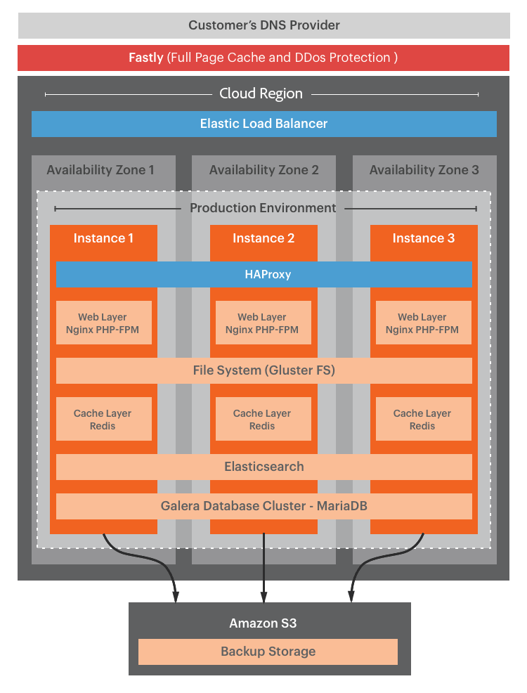

# Pro アーキテクチャ

クラウドインフラストラクチャのAdobe Commerce Pro アーキテクチャは、ストアの開発、テスト、起動に使用できる複数の環境をサポートします。

- **マスター**— `master` Platform as a Service(PaaS) コンテナにデプロイされたブランチ。
- **統合** — 単一の `integration` 開発用のブランチですが、追加のブランチを 1 つ作成することもできます。 これにより、最大 2 つまで使用できます _アクティブ_ Platform as a Service(PaaS) コンテナにデプロイされるブランチ。
- **ステージング** — 単一の `staging` 専用の Infrastructure as a service(IaaS) コンテナに導入されたブランチ。
- **実稼動** — 単一の `production` 専用の Infrastructure as a service(IaaS) コンテナに導入されたブランチ。

次の表に、環境間の違いをまとめます。

|                                        | 統合 | ステージング | 実稼動 |
| -------------------------------------- | ----------- | ----------------- | -------------------- |
| での設定管理をサポート [!DNL Cloud Console] | はい | 制限あり | 制限あり |
| 複数の分岐をサポート | はい | いいえ（ステージングのみ） | いいえ（実稼動のみ） |
| YAML ファイルを設定に使用 | はい | いいえ | いいえ |
| 専用の IaaS ハードウェア上で実行 | いいえ | はい | はい |
| Fastly CDN を含む | いいえ | はい | はい |
| New Relicサービスを含む | いいえ | APM | APM + NRI |
| 自動バックアップ | いいえ | はい | はい |

>[!NOTE]
>
>Adobeには、Adobe Commerceプロジェクトを開発およびテストできるように、ローカル Cloud Docker 環境にデプロイするための Cloud Docker for Commerce ツールが用意されています。 詳しくは、 [Docker の開発](../dev-tools/cloud-docker.md).

## 環境のアーキテクチャ

プロジェクトは、次の 3 つの主要な環境ブランチを持つ単一の Git リポジトリです。 `integration`, `staging`、および `production`. 次の図に、Pro 環境の階層関係を示します。

### マスター環境

Pro プロジェクトでは、 `master` ブランチは、アクティブな PaaS 環境と実稼動環境を提供します。 実稼動用コードのコピーを常に `master` 環境を使用して、サービスを中断することなく実稼動環境をデバッグできるようにします。

**注意事項：**

- 実行 **not** に基づいてブランチを作成します。 `master` 分岐。 統合環境を使用して、開発用のアクティブなブランチを作成します。

- 次を使用しない `master` 開発、UAT、またはパフォーマンステスト用の環境

### 統合環境

統合環境は、PaaS と呼ばれるサーバのグリッド上で Linux コンテナ (LXC) 内で動作します。 各環境には、サイトをテストする Web サーバーとデータベースが含まれています。 詳しくは、 [地域の IP アドレス](../project/regional-ip-addresses.md) :AWSおよび Azure IP アドレスのリスト。

**推奨される使用例：**

統合環境は、ステージング環境と実稼動環境に変更を移行する前に、限られたテストと開発のために設計されています。 例えば、統合環境を使用して、次のタスクを実行できます。

- 継続的統合 (CI) プロセスに対する変更が Cloud と互換性があることを確認する

- ホーム、カテゴリ、製品の詳細ページ (PDP)、チェックアウト、管理など、主要ページ上の重要なワークフローをテストする。

統合環境でのパフォーマンスを最高にするには、次のベストプラクティスに従います。

- カタログサイズを制限

- 使用を 1 人または 2 人の同時ユーザーに制限

- cron ジョブを無効にし、必要に応じて手動で実行します。

**注意事項：**

- 統合環境で Fastly CDN とNew Relicサービスにアクセスできない

- 統合環境のアーキテクチャが、ステージングと実稼動のアーキテクチャと一致しません

- 次を使用しない `integration` 開発テスト、パフォーマンステスト、またはユーザー受け入れテスト (UAT) 用の環境

- 次を使用しない `integration` B2B for Adobe Commerce機能をテストする環境

- 統合環境では、データベースの実稼動環境またはステージング環境からデータベースを復元することはできません

{{enhanced-integration-envs}}

### ステージング環境

ステージング環境は、サイトをテストするための実稼動環境の近くに用意されています。 この環境は、専用の IaaS ハードウェア上でホストされ、Fastly CDN、New Relic APM、検索などのすべてのサービスを含みます。

**推奨される使用例：**

環境は、実稼動アーキテクチャに合致し、機能をにプッシュする前の UAT、コンテンツのステージングおよび最終レビュー用に設計されています `production` 環境。 例えば、 `staging` 環境で次のタスクを実行します。

- 実稼動データに対する回帰テスト

- Fastly キャッシュが有効な場合のパフォーマンステスト

- 実稼動環境でのパッチ適用の代わりに新しいビルドをテストする

- 新しいビルドの UAT テスト

- Adobe Commerce用 B2B のテスト

- cron 設定のカスタマイズと cron ジョブのテスト

詳しくは、 [デプロイメントワークフロー](pro-develop-deploy-workflow.md#deployment-workflow) および [デプロイメントをテスト](../test/staging-and-production.md).

**注意事項：**

- 実稼動サイトを起動した後、主にステージング環境を使用して、実稼動クリティカルなバグ修正のパッチをテストします。

- ブランチは `staging` 分岐。 代わりに、 `integration` ～に分岐する `staging` 分岐。

### 実稼動環境

実稼動環境は、公開される単一サイトおよび複数サイトのストアフロントを実行します。 この環境は、冗長構成の高可用性ノードを備えた専用 IaaS ハードウェア上で稼働し、お客様の継続的なアクセスとフェイルオーバー保護を実現します。 実稼動環境には、ステージング環境のすべてのサービスに加えて、 [New Relic Infrastructure (NRI)](../monitor/new-relic-service.md#new-relic-infrastructure) サービス。アプリケーションデータおよびパフォーマンス分析と自動的に接続し、動的なサーバー監視を提供します。

**注意：**

ブランチは `production` 分岐。 代わりに、 `staging` ～に分岐する `production` 分岐。

### 実稼動テクノロジースタック

本番環境には、HAProxy が管理する Elastic Load Balancer の背後に VM（仮想マシン）が 3 台あります。 各 VM には次のテクノロジーが含まれます。

- **Fastly CDN**—HTTP キャッシュと CDN

- **NGINX**—PHP-FPM を使用する Web サーバ、複数のワーカーを持つ 1 つのインスタンス

- **GlusterFS** — すべての静的ファイル展開を管理し、4 つのディレクトリ・マウントを使用して同期を行うファイル・サーバ：

   - `var`
   - `pub/media`
   - `pub/static`
   - `app/etc`

- **レディス**:1 台のサーバを 1 台の VM につき、残りの 2 台をレプリカとして使用

- **Elasticsearch** — クラウドインフラストラクチャ 2.2 から 2.4.3-p2 上のAdobe Commerceを検索します。

- **OpenSearch**— cloud infrastructure 2.3.7-p3、2.4.3-p2、2.4.4 以降でAdobe Commerceを検索します。

- **Galera** — 各データベースの一意の ID に対して 3 つの自動増分設定を持つ、ノードごとに 1 つの MariaDB MySQL データベースを持つデータベースクラスタ。

次の図に、実稼動環境で使用されるテクノロジーを示します。

## 冗長ハードウェア

従来の積極的な受動的な `master` またはプライマリセカンダリセットアップでは、Adobe Commerce on cloud infrastructure は、 _冗長アーキテクチャ_ 3 つのインスタンスすべてが読み取りと書き込みを受け入れる場合 このアーキテクチャは、拡張時にダウンタイムをゼロにし、トランザクションの整合性を保証します。

固有の冗長ハードウェアにより、Adobeは 3 台のゲートウェイサーバを提供できます。 ほとんどの外部サービスでは、複数の IP アドレスを 1 つの許可リストに加えるに追加できるので、複数の固定 IP アドレスを持つことは問題になりません。 3 つのゲートウェイは、実稼動環境クラスター内の 3 つのサーバーにマッピングされ、静的 IP アドレスを保持します。 完全に冗長化され、あらゆるレベルで高可用性を実現します。

- DNS
- コンテンツ配信ネットワーク (CDN)
- 弾性ロードバランサー (ELB)
- データベースおよび Web サーバーを含む、すべてのAdobe Commerceサービスで構成される 3 サーバークラスター

## バックアップと災害復旧

Adobe Commerce on cloud infrastructure では、3 つの異なるAWSまたは Azure Availability Zones 上の各 Pro プロジェクトを、各ゾーンと別々のデータセンターでレプリケートする高可用性アーキテクチャを使用します。 この冗長性に加えて、Pro のステージング環境および実稼動環境では、 _悲惨な失敗_.

**自動バックアップ** MySQL データベースやマウントされたボリュームに保存されたファイルなど、実行中のすべてのサービスからの永続的なデータを含めます。 バックアップは、実稼働環境と同じリージョンの暗号化された Elastic Block Storage (EBS) に保存されます。 自動バックアップは、別のシステムに保存されているので、公にアクセスできません。

{{pro-backups}}

次の項目を作成できます。 **手動バックアップ** CLI コマンドを使用して、ステージング環境および実稼動環境用のデータベースを作成する。 詳しくは、 [データベースのバックアップ](../storage/database-dump.md). の場合 `integration` 環境の場合、Adobeでは、クラウドインフラストラクチャプロジェクト上のAdobe Commerceにアクセスし、大きな変更を適用する前に、最初の手順としてバックアップを作成することをお勧めします。 詳しくは、 [バックアップ管理](../storage/snapshots.md).

### RPO（目標復旧時点）

RPO（目標復旧時点）は、最後のバックアップに要する最大 6 時間（06:00、12:00、18:00 など）です。 バックアップの頻度は、プランのバックアップスケジュールと、ストレージサービスに書き込む変更の量によって異なります。

### 保持ポリシー

Adobeは、次のデータ保持ポリシーに従って自動バックアップを保持します。

| 期間 | バックアップ保持ポリシー |
| ------------------ | ----------------------- |
| 1 日目～ 3 日 | 1 時間に 1 つのバックアップ |
| 4 ～ 7 日 | 1 日に 1 回のバックアップ |
| 週 2 ～ 6 | 1 週間に 1 回のバックアップ |
| 週 8 ～ 12 | 隔週 1 回のバックアップ |
| 3 か月～ 5 ヶ月 | 1 ヶ月に 1 回のバックアップ |

このポリシーは、クラウドインフラストラクチャの計画によって異なる場合があります。

### 目標復旧時間

RTO は、ストレージのサイズに応じて異なります。 大きな EBS ボリュームのリストアには、より多くの時間がかかります。 復元時間は、データベースのサイズによって異なる場合があります。

- 大規模なデータベース（200 GB 以上）は、5 時間かかる場合があります
- 中程度のデータベース (150 GB) には、2 時間半に 2 時間かかる場合があります
- 小規模なデータベース (60 GB) には 1 時間かかる場合があります

{{pro-backups}}

## Pro クラスタスケーリング

Pro クラスタのサイズ設定と _計算_ 設定は、選択したクラウドプロバイダー (AWS、Azure)、地域、サービスの依存関係に応じて異なります。 Adobeクラウドインフラストラクチャは、要求の変化に応じて、トラフィックの期待値とサービス要件に対応するように Pro クラスタを拡張できます。

冗長アーキテクチャにより、Adobeクラウドインフラストラクチャをダウンタイムなしでアップスケールできます。 アップスケーリングを行うと、3 つのインスタンスのそれぞれが回転し、サイトの運用に影響を与えることなく容量をアップグレードします。 例えば、データベースレベルではなく PHP レベルで絞り込まれる場合に、既存のクラスタに Web サーバーを追加できます。 これには次の情報が含まれます。 _水平スケーリング_ データベースレベルの追加の CPU によって提供される垂直スケーリングを補完する。 詳しくは、 [拡張アーキテクチャ](scaled-architecture.md).

あるイベントやその他の理由でトラフィックが大幅に増加すると予想される場合は、一時的に容量を増やすようリクエストできます。 詳しくは、 [一時的なアップサイズをリクエストする方法](https://experienceleague.adobe.com/docs/commerce-knowledge-base/kb/how-to/how-to-request-temporary-magento-upsize.html) （内） _Commerce ヘルプセンター_.
