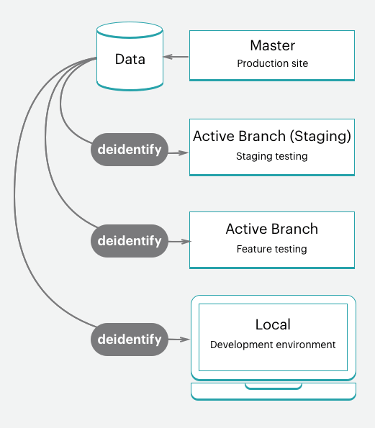

# スタータープロジェクトワークフロー

クラウドインフラストラクチャ上のAdobe Commerceには、 `master` 実稼動環境用のブランチ。テストおよび開発作業用のステージング環境と複数の統合環境を作成するために分岐できます。 アクティブな環境は、 `master` 実稼動サーバー用の環境。 詳しくは、 [スターターアーキテクチャ](starter-architecture.md) 」を参照してください。

お使いの環境では、 [!UICONTROL Development > Staging > Production] サイトを開発およびデプロイするためのワークフロー。

- **実稼動環境（ライブサイト）** — 上のコードから構築およびデプロイされるすべてのサービスを備えた、完全な実稼動環境を提供します。 `master` 分岐。
- **ステージング環境** — 実稼動環境に合致する完全なステージング環境を提供し、から構築およびデプロイされるすべてのサービスを `staging` クローンを作成するブランチ `master`.
- **統合環境** — から作成した 2 つまでのアクティブな開発環境を提供します。 `staging` 分岐。 The `integration` 環境は、Fastly やNew Relicなどのサードパーティのサービスをサポートしていません。

ブランチについては、あらゆる開発手法に従うことができます。 例えば、スクラムなどのアジャイル手法に従って、すべてのスプリントのブランチを作成できます。

各スプリントから、各ユーザストーリーの分岐を作成できます。 すべての物語がテスト可能になる。 常にスプリントブランチにマージし、そのブランチを継続的に検証できます。 スプリントが終了したら、スプリントのブランチを `master` テストのボトルネックに対応することなく、すべてのスプリントの変更を実稼動環境にデプロイする。

## 開発ワークフロー

スタータープランの開発とデプロイは、最初のプロジェクトから始まります。 完全に準備されたストアを含む、Adobe Commerce on cloud infrastructure テンプレートコードリポジトリーである「空のサイト」でプロジェクトを作成します。 これにより、 `master` ブランチを作成し、実稼動環境のコードのコピーを作成します。

開発ワークフローには、次のものが含まれます。

- [クローンとブランチ](#clone-and-branch) から `master` を作成します。 `staging` および開発ブランチ
- [コードの開発](#develop-code) を参照し、拡張機能を開発ブランチにローカルにインストールします。 [!DNL Composer] 更新
- [設定](#configure-store) ストアと拡張機能の設定
- [設定を生成](#generate-configuration-management-files) 管理ファイル
- [プッシュコード](#push-code-and-test) ビルドしてデプロイするための設定と `staging` および `production` 環境


また、コードやストアデータの開発とテストに役立つ、オプションの手順がいくつかあります。

- [サンプルデータをインストール](#optional-install-sample-data) お客様の店に
- [実稼動ストアのデータをプル](#optional-pull-production-data) 環境に合わせて

この手順は、 [ローカル開発者ワークスペース](../development/overview.md).

### クローンとブランチ

新しいスタータープランプロジェクトの場合、 `master` ブランチは、Adobe Commerce on cloud infrastructure Git リポジトリから複製されました。 分岐を開始してコードの操作を開始するには、 `master` ローカル環境に分岐します。

Git clone コマンドの形式は次のとおりです。

```bash
git fetch origin
```

```bash
git pull origin <environment-ID>
```

初めてスタータープロジェクトのブランチで作業を開始する場合は、 `staging` 分岐。 これにより、 `master` 実稼動環境にデプロイする前に設定とコードの変更をテストするためにステージング環境にデプロイするブランチ。

次に、次から分岐を作成します。 `staging` コードを開発し、拡張機能を追加して、サードパーティ統合を設定します。 カスタムコードの開発、拡張機能の追加、サードパーティのサービスとの統合をおこなう際は、いつでも、 `staging` 分岐。 4 つのアクティブな統合環境を使用できます。 アクティブなブランチをプッシュすると、これらの統合環境の 1 つにより、テスト用のコードが自動的にデプロイされます。

Git ブランチコマンドの形式は次のとおりです。

```bash
git checkout <branch-name>
```

Cloud CLI の形式 `branch` コマンドは次のとおりです。

```bash
magento-cloud environment:branch <environment-name> <parent-environment-ID>
```


### コードの開発

クラウドインフラストラクチャコード上のAdobe Commerceの基本ブランチを使用すると、拡張機能のインストール、カスタムコードの開発、テーマの追加などを開始できます。

開発作業で分岐戦略を使用します。 1 つの分岐を使用してすべての作業を一度に実行すると、テストが困難になる場合があります。 例えば、継続的な統合やスプリントの手法に従って、次のように機能できます。

- 拡張機能をいくつか追加し、最初のブランチで設定します。
- このコードをプッシュし、テストして、ステージング環境、実稼動環境にマージします。
- でサービスを完全に設定する `services.yaml` テーマを追加します。
- このコードをプッシュし、テストして、ステージング環境、実稼動環境にマージします。
- サードパーティのサービスとの統合
- このコードをプッシュし、テストして、ステージング環境、実稼動環境にマージします。

ストアが完全に構築され、設定され、起動する準備が整うまで。 しかし、読み続けると、ストアとコードの設定には多くのオプションがあります。

>[!NOTE]
>
>まだローカルワークステーションで設定を完了していない。


### ストアを設定

ストアを設定する準備が整ったら、すべてのコードを `integration` 環境。 ストア設定は、ローカル環境ではなく、統合環境用に管理者から設定します。 URL は、 **サイトにアクセス** （内） [!DNL Cloud Console]

設定に関する最良の情報については、 Adobe Commerceとインストールされている拡張機能のドキュメントを参照してください。 以下に、使い始めるのに役立つリンクとアイデアを示します。

- [ストア設定のベストプラクティス](../store/best-practices.md) クラウドの具体的なベストプラクティスについては、
- [基本設定](https://docs.magento.com/user-guide/configuration/configuration-basic.html) ストア管理者のアクセス、名前、言語、通貨、ブランディング、サイト、ストア表示など
- [テーマ](https://docs.magento.com/user-guide/design/design-theme.html) CSS やレイアウトを含むサイトおよびストアのルックアンドフィールに応じて
- [システム設定](https://docs.magento.com/user-guide/system/system.html) （役割、ツール、通知、データベースの暗号化キー）
- ドキュメントを使用した拡張機能の設定

ストア設定だけでなく、複数のサイトやストア、設定済みのサービスなどをさらに設定できます。 詳しくは、 [ストアを設定](../store/overview.md).

### 設定管理ファイルの生成

Adobe Commerceに詳しい方は、開発環境からステージング環境および実稼動環境に移行する際に、データベースから設定を取得する方法について心配になる場合があります。 以前は、すべての設定を紙面またはファイルにコピーし、手動で他の環境に適用する必要がありました。 または、データベースをダンプして別の環境にデータをプッシュした可能性があります。

Adobe Commerce on cloud infrastructure は、2 つのセットを提供します。 [設定管理](../store/store-settings.md) 環境の設定をファイルに書き出すコマンド これらのコマンドは、次の場合にのみ使用できます。 **Adobe Commerce on cloud infrastructure 2.2 以降**.

- `php .vendor/bin/ece-tools config:dump` — デフォルトから入力または変更したコンフィギュレーション設定のみをコンフィギュレーションファイルにエクスポートします。 _推奨_.
- `php bin/magento app:config:dump` — 変更済みおよびデフォルトを含むすべての設定をコンフィギュレーションファイルにエクスポートします。

生成されたファイルは次のとおりです。 `app/etc/config.php`.

Adobe Commerceを設定した統合環境でファイルを生成します。 ファイルの生成、ブランチへの追加、デプロイのプロセスを順を追って説明します。

**重要な注意事項** 設定管理で次の操作を行います。

- から生成されたファイルに含まれる設定 `app:config:dump` コマンドが、デプロイ済みの環境で編集または読み取り専用からロックされている。 これは、Adobeが `.vendor/bin/ece-tools config:dump` コマンドを使用します。

  例えば、開発環境で Fastly 用のモジュールをインストールするとします。 このモジュールは、ステージング環境と実稼動環境でのみ設定できます。 の使用 `.vendor/bin/ece-tools config:dump` コマンドを使用すると、開発変更をステージング環境と実稼動環境にデプロイする際に、これらのデフォルトフィールドを編集可能なままになります。

- 生成されるファイルは、デプロイメントのサイズに応じて長くなる場合があります。 The `.vendor/bin/ece-tools config:dump` コマンドを実行すると、 `app:config:dump` コマンドを使用します。

Adobe Commerceバージョン 2.2 以降を使用している場合は、PayPal モジュールのサンドボックス資格情報など、機密データを保護する追加機能が設定管理コマンドに用意されています。 書き出しプロセス中に、機密データを含むすべての値が別々の設定ファイルに書き出されます。`env.php` （内） `app/etc/` ディレクトリ。 このファイルはローカル環境に残り、コードを別のブランチにプッシュしてもコピーされません。 また、クラウドインフラストラクチャのすべてのバージョンのAdobe Commerceで、CLI コマンドを使用して環境変数を作成することもできます。


詳しくは、 [設定管理](../store/store-settings.md).

### コードをプッシュしてテスト

この時点で、設定ファイル (`config.local.php` または `config.php`) をテストの準備が整いました。

ローカル環境からコードをプッシュするたびに、一連のビルドおよびデプロイスクリプトが実行されます。 これらのスクリプトは、新しいコードを生成し、リモート環境にデプロイします。 例えば、ローカル環境からリモートブランチに開発ブランチをプッシュする場合、一致する環境によってサービス、コード、静的コンテンツが更新されます。

この環境には、ストア URL、管理 URL、SSH を使用して直接アクセスできます。 これらの環境には、Web サーバー、データベース、設定済みのサービスが含まれます。 準備が整ったら、ステージング環境でデプロイおよびテストを開始できます。

詳しくは、 [デプロイメントワークフロー](#deployment-workflow).

### オプション：サンプルデータのインストール

ストアの開発時にサンプルデータが必要な場合は、サンプルデータをインストールできます。 このデータは、顧客、製品、その他のデータを含むアクティブなストアをシミュレートします。 このサンプルデータは、プロジェクトを作成する際に、クラウドインフラストラクチャテンプレートのインストールに「空のサイト」Adobe Commerceを使用する場合に最も適しています。 ベストプラクティスとして、運用を開始する前にサンプルデータを削除します。 詳しくは、 [オプションのサンプルデータをインストール](../test/sample-data.md).


### オプション：実稼動データのプル

すべての製品、カタログ、サイトコンテンツなどを `production` 環境。 このデータを実稼動環境に追加することで、顧客に対して、更新された価格、クーポン、在庫、販売のお知らせ、将来のオファーに関する情報などを提供できます。 このデータには、拡張機能ブランチで設定した拡張機能の設定は含まれません。

機能を開発し、拡張機能やデザインテーマを追加すると、実際に使用するデータを持つことが役に立ちます。 いつでも、 [データベースダンプの作成](../storage/database-dump.md) を実稼動環境から実行し、必要に応じてステージング環境および統合環境にプッシュします。

実稼動データをテストデータとしてエクスポートし、ステージング環境および統合環境で使用するには、次の手順を実行します。

- [サポートユーティリティを実行する](https://experienceleague.adobe.com/docs/commerce-operations/configuration-guide/cli/run-support-utilities.html) 顧客の保護されたバックアップをエクスポートし、Adobe Commerceの暗号化キーを使用してデータを保存する場合の CLI コマンド（推奨）

- [データ収集](https://docs.magento.com/user-guide/system/support-data-collector.html) データの生成とエクスポートを行うツール

このデータを移行するには、 [静的ファイルとデータの移行とデプロイ](../deploy/staging-production.md#migrate-static-files).



>[!NOTE]
>
>データを別の環境にプッシュする前に、データのサニタイズを検討する必要があります。 次のようなオプションがあります。 [サポートユーティリティの使用](https://experienceleague.adobe.com/docs/commerce-operations/configuration-guide/cli/run-support-utilities.html) または、顧客データをスクラブアウトするスクリプトの作成。

>[!WARNING]
>
>統合環境またはステージング環境から実稼動環境にデータベースをプッシュしないでください。 設定すると、統合またはステージング環境のデータによって、販売、注文、新規および更新された顧客など、実稼動データが上書きされます。

## デプロイメントワークフロー

アーキテクチャ情報で詳しく説明しているように、クラウドインフラストラクチャ上のAdobe Commerceは Git を主導しています。 クラウドインフラストラクチャにAdobe Commerceをデプロイすることは、ブランチの Git プッシュプロセスの一部です。

ローカル環境からリモートブランチにブランチコードをプッシュすると、一連のビルドおよびデプロイスクリプトが開始されます。

スクリプトの作成：

- ターゲット環境のサイトは、ビルド中も引き続き実行されます

- クラウドインフラストラクチャのパッチとホットフィックスでAdobe Commerceを確認して実行する

- ビルドおよびデプロイログでコードをコンパイルします。

- このフェーズで静的コンテンツのデプロイメントが発生した場合は、設定管理をチェックします。

- 変更されていないコードのスラッグを作成または使用して、より迅速な処理を実現

- すべてのバックエンドサービスとアプリケーションをプロビジョニング

スクリプトのデプロイ：

- サイトをメンテナンスモードのターゲット環境に配置する

- ビルド中に完了していない場合に静的コンテンツをデプロイします

- クラウドインフラストラクチャ上のAdobe Commerceをインストールまたは更新します

- トラフィックのルーティングの設定

完全に完了すると、ストアがオンラインで、ライブに戻り、すべての更新されたコードと設定が反映されます。

詳しくは、 [デプロイメントプロセス](../deploy/process.md).

### ステージングおよびテストにプッシュ

常にコードを繰り返しに `staging` 完全なテスト用の環境。 この環境を初めて使用する場合は、次のようなサービスを設定する必要があります。 [Fastly](/help/cloud-guide/cdn/fastly.md) および [New Relic](../monitor/new-relic-service.md). また、サンドボックスまたはテスト資格情報を使用して、支払いゲートウェイ、発送先、通知、その他の重要なサービスを設定します。

ステージングは、実稼動前の環境で、実稼動にできるだけ近いすべてのサービスと設定を提供します。 すべてのサービスを徹底的にテストし、パフォーマンステストツールを検証し、管理者として UAT テストを実行し、ストアが実稼動に向けて準備できたと感じるまで、お客様として UAT テストを実行します。

詳しくは、 [ストアをデプロイ](../deploy/staging-production.md).

### 実稼動環境にプッシュ

を `master` ブランチ、 `production` 環境。 ステージング環境と同様に、実稼動環境でのアクティビティの設定とテストを完了するには、重要な違いが 1 つあります。 実稼動環境では、設定とテストにライブ資格情報を使用します。 サイトを起動すると、顧客が購入を完了し、管理者がライブストアを管理できます。

詳しくは、 [ストアをデプロイ](../deploy/staging-production.md).

### サイトの起動

サイトでのライブには、明確なウォークスルーがあります。 これらの手順を完了すると、ストアは、カスタマイズされたテーマで製品をすぐに提供して、販売できます。

詳しくは、 [サイトの起動](../launch/overview.md).

## 継続的な統合

分岐と開発の方法に従えば、新しい機能の開発、変更の設定、継続的なアップデートの開発とデプロイを行うための拡張機能の追加を簡単におこなえます。

すべてのクラウドインフラストラクチャ環境は、継続的な更新のための継続的な統合をサポートしています。 このワークフローでは、ビジネスニーズに応じて、1 日に複数回、または設定されたスケジュールでリリースをサポートします。

- 将来の機能と変更を含む開発ブランチの作成

- のコードをテストします。 `integration` 環境

- でのデプロイとテスト `staging` 環境

- にデプロイします。 `production` 環境
