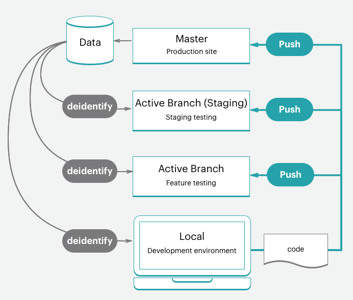

# スタータープロジェクトワークフロー

Adobe Commerce on cloud インフラストラクチャには、を持つ 1 つの Git リポジトリーが含まれます。 `master` 実稼動環境のブランチ。テストおよび開発作業用にステージング環境と複数の統合環境を作成するために分岐できます。 次の環境を含む最大 4 つのアクティブな環境を持つことができます `master` 実稼動サーバーの環境。 参照： [スターターアーキテクチャ](starter-architecture.md) を参照してください。

お使いの環境で、次の手順を実行します [!UICONTROL Development > Staging > Production] サイトを開発およびデプロイするためのワークフローです。

- **実稼動環境（ライブサイト）** – 上のコードから構築およびデプロイされたすべてのサービスを含む、完全な実稼動環境を提供します `master` 分岐。
- **ステージング環境** – 実稼動環境と一致する、から構築およびデプロイされるすべてのサービスを備えた完全なステージング環境を提供します。 `staging` 複製によって作成するブランチ `master`.
- **統合環境** – から作成するアクティブな開発環境を最大 2 つ提供します。 `staging` 分岐。 この `integration` environment は、Fastly やNew Relicなどのサードパーティサービスをサポートしていません。

ブランチの場合は、任意の開発手法に従うことができます。 例えば、スクラムなどのアジャイル手法に従って、スプリントごとに分岐を作成できます。

各スプリントから、各ユーザーストーリーの分岐を作成できます。 すべてのストーリーがテスト可能になります。 スプリントの分岐に継続的に結合し、その分岐を継続的に検証できます。 スプリントが終了したら、スプリントのブランチをに結合できます `master` テストのボトルネックに対処することなく、すべてのスプリント変更を実稼動環境にデプロイする。

## 開発ワークフロー

スタータープランでの開発とデプロイメントは、最初のプロジェクトから始めます。 「空白のサイト」（クラウドインフラストラクチャテンプレート上のAdobe Commerceのコードリポジトリ）を使用してプロジェクトを作成し、完全に準備されたストアを含めます。 これにより、が作成されます `master` 実稼動環境のコードのコピーを使用して分岐します。

開発ワークフローには以下が含まれます。

- [クローンとブランチ](#clone-and-branch) から `master` 作成対象 `staging` および開発部門
- [コードの開発](#develop-code) 拡張機能を開発ブランチにローカルにインストールする。これには以下が含まれます [!DNL Composer] 更新
- [設定](#configure-store) ストアと拡張機能の設定
- [設定を生成](#generate-configuration-management-files) 管理ファイル
- [プッシュコード](#push-code-and-test) ビルドしてデプロイする設定と `staging` および `production` 環境



また、コードとストアデータの開発とテストに役立つオプションの手順もあります。

- [サンプルデータのインストール](#optional-install-sample-data) あなたの店に
- [実稼動ストアデータの取り込み](#optional-pull-production-data) 環境に依存

このプロセスは、 [ローカル開発者ワークスペース](../development/overview.md).

### クローンとブランチ

新規スタータープランプロジェクトの場合、 `master` ブランチはAdobe Commerce on cloud infrastructure Git リポジトリから複製されました。 コードのブランチと操作を開始するには、 `master` ローカル環境に分岐します。

Git clone コマンドの形式は次のとおりです。

```bash
git fetch origin
```

```bash
git pull origin <environment-ID>
```

スタータープロジェクトのブランチで初めて作業を開始するときは、を作成します `staging` 分岐。 これにより、に一致するコードブランチが作成されます `master` ステージング環境にデプロイするブランチで、実稼動環境にデプロイする前に設定とコードの変更をテストします。

次に、からブランチを作成します。 `staging` コードを開発し、拡張機能を追加して、サードパーティ統合を設定します。 カスタムコードを開発したり、拡張機能を追加したり、サードパーティのサービスと統合したりするたびに、から作成された開発ブランチで作業します。 `staging` 分岐。 4 つのアクティブな統合環境を使用できます。 アクティブなブランチをプッシュすると、これらの統合環境の 1 つがテストするコードを自動的にデプロイします。

Git ブランチ コマンドの形式は次のとおりです。

```bash
git checkout <branch-name>
```

Cloud CLI の形式 `branch` コマンド：

```bash
magento-cloud environment:branch <environment-name> <parent-environment-ID>
```


### コードの開発

クラウドインフラストラクチャコード上のAdobe Commerceのベースブランチを使用すると、拡張機能のインストール、カスタムコードの開発、テーマの追加などを開始できます。

開発作業でブランチ戦略を使用します。 1 つのブランチですべての作業を一度に行うと、テストが難しくなる場合があります。 例えば、継続的統合とスプリントの方法論に従って作業できます。

- 拡張機能をいくつか追加し、最初のブランチで設定します
- このコードをプッシュし、テストして、ステージング環境から実稼動環境に結合します
- でのサービスの完全な設定 `services.yaml` テーマを追加する
- このコードをプッシュし、テストして、ステージング環境から実稼動環境に結合します
- サードパーティのサービスとの統合
- このコードをプッシュし、テストして、ステージング環境から実稼動環境に結合します

ストアを完全に構築、設定し、ローンチする準備ができるまで。 ただし、ストアとコードの設定には多くのオプションがあります。

>[!NOTE]
>
>ローカル ワークステーションの設定は、まだ完了していません。


### ストアの設定

ストアを設定する準備が整ったら、すべてのコードをにプッシュします。 `integration` 環境。 ローカル環境ではなく、統合環境用に管理者からストアの設定を指定します。 URL を見つけるには、 **サイトへのアクセス** が含まれる [!DNL Cloud Console]

設定に関する最適な情報については、Adobe Commerceのドキュメントとインストールされている拡張機能を参照してください。 開始に役立つリンクとアイデアを次に示します。

- [ストア設定のベストプラクティス](../store/best-practices.md) クラウド内の特定のベストプラクティス
- [基本設定](https://docs.magento.com/user-guide/configuration/configuration-basic.html) ストア管理アクセス、名前、言語、通貨、ブランディング、サイト、ストア表示など
- [テーマ](https://docs.magento.com/user-guide/design/design-theme.html) サイトとストアのルックアンドフィール（CSS とレイアウトを含む）を確認します
- [システム設定](https://docs.magento.com/user-guide/system/system.html) 役割、ツール、通知およびデータベースの暗号化キー
- ドキュメントを使用した拡張機能の設定

ストアの設定だけでなく、複数のサイトやストア、設定されたサービスなどをさらに設定できます。 参照： [ストアの設定](../store/overview.md).

### 構成管理ファイルの生成

Adobe Commerceに精通しているユーザーは、開発環境のデータベースからステージング環境および実稼動環境に設定を取得する方法を気にする必要があります。 以前は、すべての設定を紙またはファイルにコピーしてから、手動でその設定を他の環境に適用する必要がありました。 または、データベースをダンプし、そのデータを別の環境にプッシュした可能性があります。

クラウドインフラストラクチャー上のAdobe Commerceには、次の 2 つの機能があります [設定の管理](../store/store-settings.md) 環境設定を環境からファイルに書き出すコマンド。 これらのコマンドは、次の場合にのみ使用できます **クラウドインフラストラクチャー 2.2 以降でのAdobe Commerce**.

- `php .vendor/bin/ece-tools config:dump` – 入力またはデフォルトから変更したコンフィギュレーション設定のみをコンフィギュレーションファイルにエクスポートします。 _推奨_.
- `php bin/magento app:config:dump` – 変更された設定やデフォルトの設定を含むすべての設定を設定ファイルにエクスポートします。

生成されるファイルは以下のとおりです。 `app/etc/config.php`.

Adobe Commerceを設定した統合環境にファイルを生成します。 ファイルを生成し、ブランチに追加してデプロイするプロセスを順を追って説明します。

**重要な注意事項** 設定管理で、次の操作を行います。

- から生成されたファイルに含まれているすべての設定 `app:config:dump` デプロイされた環境で、コマンドが編集または読み取り専用でロックされている。 これが、Adobeが以下を使用することをお勧めする理由の 1 つです。 `.vendor/bin/ece-tools config:dump` コマンド。

  例えば、開発環境に Fastly 用のモジュールをインストールします。 ステージング環境および実稼動環境では、このモジュールのみを設定できます。 使用， `.vendor/bin/ece-tools config:dump` コマンドは、開発変更をステージング環境および実稼動環境にデプロイする際、これらのデフォルトフィールドを編集可能に保ちます。

- 生成されるファイルは、デプロイメントのサイズによっては長くなる場合があります。 この `.vendor/bin/ece-tools config:dump` コマンドは、 `app:config:dump` コマンド。

Adobe Commerce バージョン 2.2 以降を使用している場合、Configuration Management コマンドには、PayPal モジュールのサンドボックス資格情報などの機密データを保護する追加機能が用意されています。 書き出しプロセス中に、機密データを含むすべての値が、別の設定ファイルに書き出されます。`env.php` が含まれる `app/etc/` ディレクトリ。 このファイルはローカル環境に残り、コードを別のブランチにプッシュしてもコピーされません。 また、クラウドインフラストラクチャバージョン上のすべてのAdobe Commerceで、CLI コマンドを使用して環境変数を作成することもできます。


参照： [設定の管理](../store/store-settings.md).

### コードとテストのプッシュ

この時点で、設定ファイル（`config.local.php` または `config.php`）をテストする準備が整いました。

ローカル環境からコードをプッシュするたびに、一連のビルドスクリプトとデプロイスクリプトが実行されます。 これらのスクリプトは、新しいコードを生成して、リモート環境にデプロイします。 例えば、開発ブランチをローカル環境からリモートブランチにプッシュする場合、一致する環境でサービス、コードおよび静的コンテンツが更新されます。

ストア URL、管理者 URL、SSH を使用して、この環境に直接アクセスできます。 これらの環境には、web サーバー、データベース、設定済みサービスが含まれます。 準備が整ったら、ステージング環境でデプロイとテストを開始できます。

詳しくは、を参照してください [デプロイメントワークフロー](#deployment-workflow).

### オプション：サンプル・データのインストール

ストアの開発時にサンプルデータが必要な場合は、サンプルデータをインストールできます。 このデータは、顧客、製品、その他のデータを含む、アクティブなストアをシミュレートします。 このサンプルデータは、プロジェクトの作成時にクラウドインフラストラクチャテンプレートの「空白のサイト」Adobe Commerceで最適に機能します。 ベストプラクティスとして、運用を開始する前にサンプルデータを削除してください。 参照： [オプションのサンプルデータをインストールする](../test/sample-data.md).


### オプション：実稼動データの取り込み

すべての製品、カタログ、サイトコンテンツなどを `production` 環境。 このデータを実稼動環境に追加すると、更新された価格、クーポン、在庫在庫、販売のお知らせ、今後のオファーに関する情報などを顧客に提供できます。 このデータには、ローカル開発ブランチで設定した拡張機能の設定は含まれていません。

機能を開発したり、拡張機能を追加したり、テーマをデザインしたりする際に、実際のデータを操作できると便利です。 いつでも、次のことができます [データベースダンプの作成](../storage/database-dump.md) 実稼動環境から、必要に応じてステージング環境および統合環境にプッシュします。

実稼働データをテストデータとしてエクスポートし、ステージング環境と統合環境で使用できるようにするには、次の手順に従います。

- [サポートユーティリティを実行します](https://experienceleague.adobe.com/docs/commerce-operations/configuration-guide/cli/run-support-utilities.html) Adobe Commerce暗号化キーを使用して、お客様およびストアデータの保護されたバックアップを書き出す際の CLI コマンド （推奨）

- [データ収集](https://docs.magento.com/user-guide/system/support-data-collector.html) データの生成および書き出しツール

このデータを移行するには、を参照してください。 [静的ファイルおよびデータの移行とデプロイ](../deploy/staging-production.md#migrate-static-files).


>[!NOTE]
>
>データを別の環境にプッシュする前に、データのサニタイズを検討する必要があります。 次のようなオプションがいくつかあります [サポートユーティリティの使用](https://experienceleague.adobe.com/docs/commerce-operations/configuration-guide/cli/run-support-utilities.html) または、顧客データをスクラブするスクリプトを開発します。

>[!WARNING]
>
>データベースを統合環境またはステージング環境から実稼動環境にプッシュしないでください。 その場合、統合環境またはステージング環境からのデータによって、販売、注文、新規顧客および更新顧客などのライブ実稼動データが上書きされます。

## デプロイメントワークフロー

アーキテクチャ情報で詳しく説明しているように、クラウドインフラストラクチャー上のAdobe Commerceは Git 主導です。 クラウドインフラストラクチャへのAdobe Commerceのデプロイは、ブランチの Git プッシュプロセスの一部です。

分岐したコードをローカル環境からリモートブランチにプッシュすると、一連のビルドスクリプトとデプロイスクリプトが開始されます。

ビルドスクリプト：

- ターゲット環境内のサイトは、ビルド中も実行を続けます

- Adobe Commerce on cloud infrastructure のパッチおよびホットフィックスを確認して実行します。

- ビルドおよびデプロイログを使用したコードのコンパイル

- 静的コンテンツのデプロイメントがこのフェーズで行われるかどうかを構成管理で確認します

- 変更されていないコードのスラッグを作成または使用すると、プロセスを高速化できます

- すべてのバックエンドサービスおよびアプリケーションのプロビジョニング

スクリプトをデプロイします。

- サイトをターゲット環境にメンテナンスモードにします

- ビルド中に完了しない場合は静的コンテンツをデプロイ

- クラウドインフラストラクチャにAdobe Commerceをインストールまたは更新します

- トラフィックのルーティングの設定

完了すると、更新されたすべてのコードと設定を使用して、ストアがオンラインでライブ状態に戻ります。

参照： [デプロイメントプロセス](../deploy/process.md).

### ステージングおよびテストへのプッシュ

コードは常に以下に繰り返しプッシュします `staging` 完全なテストの環境。 この環境を初めて使用する場合、次のようないくつかのサービスを設定する必要があります [Fastly](/help/cloud-guide/cdn/fastly.md) および [New Relic](../monitor/new-relic-service.md). また、サンドボックスまたはテスト資格情報を使用して、支払いゲートウェイ、配送、通知、その他の重要なサービスを設定します。

ステージングは実稼動前の環境であり、可能な限り実稼動環境に近いすべてのサービスと設定を提供します。 ストアが実稼動の準備ができていると感じられるまで、すべてのサービスを徹底的にテストし、パフォーマンステストツールを検証し、管理者および顧客として UAT テストを実行します。

参照： [ストアのデプロイ](../deploy/staging-production.md).

### 実稼動へのプッシュ

にプッシュした場合 `master` 分岐、次にプッシュしています： `production` 環境。 ステージング環境と同様に、実稼動環境での設定およびテストアクティビティを、1 つの重要な違いを除いて完了します。 実稼動環境では、設定とテストにライブ資格情報を使用します。 サイトが立ち上げられた瞬間に、顧客は購入を完了でき、管理者はライブストアを管理できます。

参照： [ストアのデプロイ](../deploy/staging-production.md).

### サイトの起動

サイトの運用を開始するための明確な手順があります。 これらの手順を完了すると、カスタマイズしたテーマの製品をすぐに販売することができます。

参照： [サイトの起動](../launch/overview.md).

## 継続的統合

ブランチと開発の方法論に従って、新機能を簡単に開発し、変更を設定し、拡張機能を追加して、更新を継続的に開発およびデプロイできます。

すべてのクラウドインフラストラクチャ環境で、継続的な統合をサポートして、継続的なアップデートを実現します。 このワークフローでは、ビジネスニーズに応じて、1 日に複数回、または設定したスケジュールでリリースをサポートします。

- 今後の機能および変更を伴う開発部門の作成

- 内のコードのテスト `integration` 0.9511122

- でのデプロイとテスト `staging` 0.9511122

- にデプロイ `production` 0.9511122
