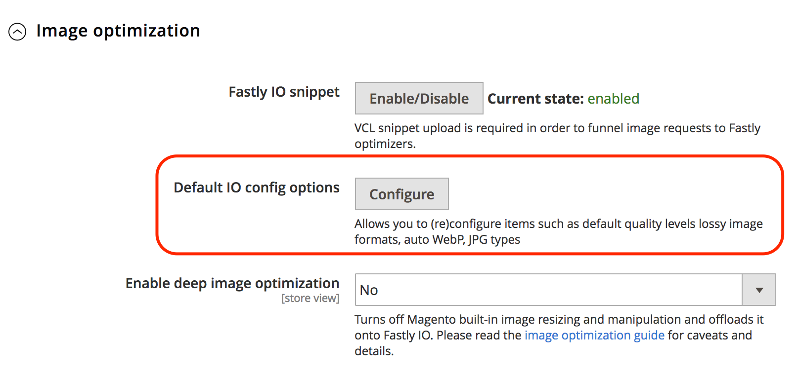

# Fastly 画像の最適化

Fastly 画像最適化（Fastly IO）は、リアルタイムの画像操作と最適化を提供し、画像配信を高速化し、レスポンシブ web アプリケーションの画像ソースセットのメンテナンスを簡素化します。 設定が完了すると、Fastly IO は次の画像最適化機能を提供します。

- 非可逆変換を強制
- 深みのある画像の最適化
- アダプティブピクセル比
- 一般的な画像形式（PNG、JPEG、GIF、WebP）のサポート

Fastly IO オプションを有効にして設定する前に、Fastly サービスを設定し、オリジンシールドを設定する必要があります。

設定に基づいて、Fastly 画像最適化（Fastly IO）スニペットは VCL コードを挿入し、画像最適化を実行して、ストアフロントでの製品画像配信を高速化します。 Fastly IO を設定するには、有効化、設定、検証の 3 つのステップがあります。

## Fastly IO の有効化

Fastly IO VCL スニペットをアップロードして、管理パネルから Fastly 画像最適化（Fastly IO）を有効にします。 このスニペットは、デフォルトの設定を使用して、画像オプティマイザーを通じてすべての画像を処理する Fastly 設定手順を提供します。

**前提条件：**

- Fastly モジュールバージョン 1.2.62 以降をインストールまたはアップグレード
- [Fastly オリジンシールドとバックエンドの設定](fastly-custom-cache-configuration.md#configure-back-ends-and-origin-shielding)

**Fastly IO を有効にするには**:

1. ローカルにログイン [Admin](../../get-started/onboarding.md#access-your-admin-panel) 管理者としてのパネル。

1. を選択 **ストア** > **設定** > **設定** > **詳細** > **システム**.

1. 右側のパネルで、を展開します **フルページキャッシュ**.

1. を選択 **Fastly 設定** > **画像の最適化** をクリックして、設定を指定します。

1. が含まれる _Fastly IO スニペット_ フィールド、選択 **有効/無効**.

1. Fastly IO スニペットをアップロードします。

   - を選択 **デフォルトの I/O 設定オプション** をクリックして、「画像の最適化のデフォルト設定オプション」ページを開きます。
   - を選択 **Upload** :VCL スニペットをサーバーにアップロードします。

## Fastly IO の設定

必要に応じて、画像の最適化に向けたデフォルトの IO 設定を確認して更新します。 例えば、非可逆フォーマットの WebP とJPEGの画質レベルを変えたり、JPEG画像を提供するフォーマットをに変えたりする場合があります。 _進行_ または _ベースライン_. また、Fastly IO を使用して、次のようなより詳細な画像最適化機能を実行できます。

- 非可逆変換を強制
- 深みのある画像の最適化
- アダプティブピクセル比

**Fastly IO を更新するには**:

1. 日 _Fastly 設定_ 内のページ _デフォルトの I/O 設定オプション_ フィールド、選択 **設定**.

   

1. で Fastly IO 設定を確認し更新します。 _画像の最適化のデフォルト設定オプション_ ページ：

   

   - **自動 WebP?**— デフォルト設定のままにします（`Yes`）を選択して、画像をサポートするブラウザーで WebP 形式に変換します。 設定をに変更した場合 **不可**&#x200B;では、画像を WebP 形式に変換する代わりに、画像ファイルタイプが使用されます。

   - **デフォルトの WebP （非可逆）画質**— デフォルト設定のままにします（`85`）を選択するか、非可逆ファイル形式の画像の圧縮レベルを入力します。 1 ～ 100 の任意の整数を指定できます。

   - **デフォルトのJPEG形式コントロール** — デフォルト設定のままにします（`Auto`）を選択するか、画像の提供時に使用するJPEGタイプを選択します。 値がに設定されている場合 _自動_&#x200B;は、入力タイプに一致する出力タイプを使用して画像を配信します。 を選択 _ベースライン_ 左上から右下に向かうラインごとに画像を表示します。 を選択 _進行_ 読み込み時に鮮明になるボケた画像を表示する。

   - **デフォルトのJPEG画質**— デフォルト設定のままにします（`85`）を選択するか、非可逆ファイル形式の品質の圧縮レベルを入力します。 1 から 100 までの任意の整数を指定します。

   - **アップスケーリングを許可しますか？** – デフォルト設定のままにする（`No`）、または `Yes` 元のソースファイルよりも大きい画像を返して、要求されたサイズに合わせることができるようにします。

   - **フィルターのサイズ変更**— デフォルト設定のままにします（`Lancsoz3`）を選択するか、代替値を選択します。 この設定では、サイズ変更された画像を配信するために使用するフィルターを指定します。 選択したフィルターによって、サイズ変更された画像のピクセル数は異なる場合があります。

      - `Lanczos3` （デフォルト） – 最高品質の画像を配信します。 これにより、画像内のエッジおよびリニア フィーチャを検出する機能が向上し、次の機能が使用されます _[!DNL sinc]_可能な限り最高の再構築を提供するために再サンプリングします。
      - `Lanczos2` – と同じフィルタを使用する `Lancsoz3` しかし、次のような不正確な近似を使用します _[!DNL sinc]_再サンプリング関数。
      - `Bicubic` – 画像を小さくするときに自然なシャープ効果を持ちます。
      - `Bilinear`- イメージを大きくすると、自然なスムージング効果が得られます。
      - `Nearest`- ピクセルアートのサイズを変更するときに、自然なピクセル化効果を持ちます。

1. Fastly サービスの I/O 設定を指定したら、以下を選択します。 **キャンセル** をクリックして、Fastly 設定に戻ります。

1. 画像の最適化設定の場合 _ディープ画像の最適化を有効にする_ フィールド、選択 **はい** でディープ画像の最適化をオンにします。

   

   深い画像の最適化は、デフォルトではオフになっています。 この機能を有効にすると、Adobe Commerceに組み込まれているサイズ変更機能がオフになり、サイズ変更作業が Fastly IO サービスにオフロードされます。 画像の最適化は、製品画像にのみ適用されます。 CMS 画像のサイズは変更されません。 を参照してください。 [Fastly ドキュメント](#deep-image-optimization).

1. ディープ画像の最適化を有効にしたら、 [適応画素比](#adaptive-pixel-ratios) レスポンシブ web サイトでの使用に最適化された画像を生成する機能。

   

   - が含まれる _アダプティブデバイスのピクセル比を有効にする_ フィールド、選択 **はい**.
   - が含まれる _デバイスピクセル比_ フィールドで、デフォルトの設定をそのまま使用するか、 **システム入力** チェックボックスをオンにして、設定を削除します。 次に、目的の比率を選択します。 デバイスピクセル比の設定を高くすると、画像が大きくなります。

1. を選択 **設定を保存**.

### 非可逆変換を強制

デフォルトでは、Fastly IO サービスは PNG、BMP、WEBP などの可逆形式をJPEG/WEBP 形式に強制的に変換します。

非可逆変換を強制的に行う利点は、小さい画像が提供されることです。
例えば、PNG の代わりにJPEGまたは WEBp 形式を使用すると、Fastly IO 設定で指定された品質レベルに応じて、サイズを 60～70% 縮小できます。

画像の最適化に選択した画質レベルによっては、画像の視覚的な違いが認識される場合があります。 例えば、テーマの背景色を使用するディープ画像の最適化を使用しない限り、Alphaのチャンネルや透明度は削除され、白い背景に置き換えられます。

非可逆変換をオフにした場合（`WebP Auto? = No`）、Fastly IO は、互換性のあるブラウザーのJPEGイメージを WEBP 形式にのみ変更します。 他の画像タイプは変更されません。 例えば、元の画像が PNG の場合、Fastly IO サービスからの出力は PNG になります。

### 深みのある画像の最適化

深い画像の最適化は、デフォルトではオフになっています。 このオプションを有効にすると、組み込みのAdobe Commerceのサイズ変更がオフになり、Fastly IO サービスに完全にオフロードされます。
この機能はサイズ変更のみを行います _製品_ 画像。 CMS 画像のサイズは変更されません。

深みのある画像の最適化を有効にすると、テーマで定義されたすべての画像に背景色の定義が追加されます。 その結果、WebP 画像は WebP 非可逆から WebP 非可逆に切り替わります。 非可逆と非可逆の大きな違いの 1 つは、PNG 画像からアルファチャネルが非可逆でドロップされ、非常に小さな画像が得られることです。 ただし、異なる背景を使用する製品ページやキャンペーンページでは、透明度のある画像が奇妙に見える場合があります。

例えば、次のコードは、Luma テーマの画像の元のソースを表します。

```html

```

Fastly IO ディープ画像最適化機能が有効になっている場合、次の例に示すように、画像の元のソースコードが書き換えられます。

```html

```

### アダプティブピクセル比

アダプティブピクセル比機能は、プログレッシブ web アプリケーション用の画像を最適化する場合に役立ちます。 を追加することで、1 つの画像ソースファイルから複数の画像サイズと解像度を配信できます。 `srcset` （製品画像ごとに表示）。

アダプティブピクセル比機能が有効になっている場合、Fastly IO サービスは、様々な変化に対応できる固定幅の画像を配信します `device-pixel-ratios`.
例えば、次の例に示すように、サービスによって製品画像の定義が変更されます。

```html

```

参照： `srcset` [ブラウザーのサポート](https://caniuse.com/#feat=srcset) および [仕様](https://html.spec.whatwg.org/multipage/embedded-content.html#attr-img-srcset).

## Fastly IO の検証

Fastly IO を有効にして設定した後、Fastly IO を有効にした場合と無効にした場合の web ページの速度テストを実行して、設定を検証します。 また、ストア内の画像をレビューして、画像のサイズや外観に問題がないか確認します。
