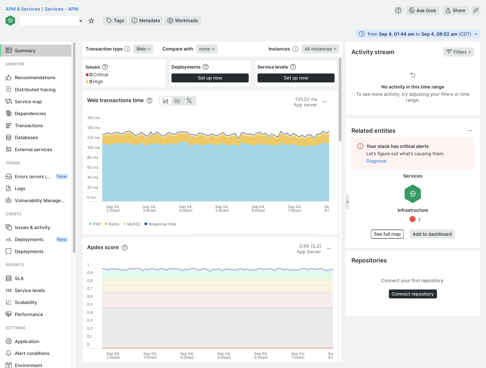
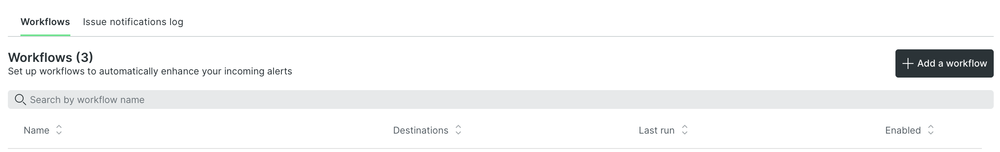

# New Relic監視

New Relicは、インフラストラクチャと [!DNL Commerce] PHP エージェントを使用するアプリケーション。 クラウド環境がNew Relicに接続したら、New Relicアカウントにログインして、エージェントが収集したデータを確認できます。

次の日： _APM とサービス_ ページで、 **概要** を使用して、アプリケーションに関するトランザクション情報を表示します。 この表示では、潜在的なエラーを特定し、アプリケーションおよびサービスの全体的な正常性を確認できます。

このビューから、低速な応答またはボトルネック、アプリケーションのスループット、Web エラーなどの発生したトランザクションを追跡できます。

追跡データを確認する：

- **最も時間がかかる** — リクエストを並行して追跡し、消費時間を決定します。 例えば、製品ビューとカテゴリビューで費やされたトランザクション時間が最も長い場合があります。 顧客アカウントページで時間の消費が突然高くランク付けされた場合は、呼び出しまたはクエリドラッグのパフォーマンスの影響を受ける可能性があります。

- **最高のスループット** — 送信されるバイト数とバイト数に基づいて、最もヒット数の多いページを識別します。

収集されたすべてのデータは、データ、クエリ、または _レディス_ データ。 クエリが問題を引き起こす場合、New Relicはそれらの問題を追跡し、対応する情報を提供します。

>[!TIP]
>
>このデータを使用してアプリケーションのパフォーマンスの問題をトラブルシューティングする方法について詳しくは、 [New Relicを使用したパフォーマンスのトラブルシューティング](https://experienceleague.adobe.com/docs/commerce-knowledge-base/kb/troubleshooting/miscellaneous/troubleshoot-performance-using-new-relic-on-magento-commerce.html) （内） _Adobe Commerce Help Center_.

## 管理されたアラートでパフォーマンスを監視する

Adobeは、 _Adobe Commerce用管理アラート_ パフォーマンス指標を追跡するアラートポリシー。 このポリシーには、しきい値とトリガーの警告、およびインフラストラクチャやアプリケーションの問題がサイトのパフォーマンスに影響を与えた場合の重要な通知を設定するアラートの集まりが含まれます。 このポリシーは、実稼動環境で次の指標を追跡します。

| 指標 | データ収集 | 対象 |
|:-------------------|:----------------|:----------------|
| [!DNL Apdex] スコア | APM | Pro および Starter |
| CPU 使用率 | NRI | Pro |
| ディスク容量 | NRI | Pro |
| エラー率 | APM | Pro および Starter |
| メモリ使用量 | NRI | Pro |
| MariaDB クエリの読み込み | NRI | Pro |
| Redis メモリ | NRI | Pro |

サイトのインフラストラクチャまたはアプリケーションの状態がトリガーしきい値にアラート通知を送信すると、New Relicは問題をプロアクティブに解決できます。 詳しくは、 [Adobe Commerce用管理アラート](https://experienceleague.adobe.com/docs/commerce-knowledge-base/kb/support-tools/managed-alerts/managed-alerts-for-magento-commerce.html) （内） _Adobe Commerce Help Center_ アラートしきい値と、アラートをトリガーした問題を解決するためのトラブルシューティング手順の詳細。

>[!TIP]
>
>Pro ステージング環境および統合環境およびスターター環境の場合は、 [ヘルス通知](../integrations/health-notifications.md) ディスク容量を監視する。

>[!PREREQUISITES]
>
>- **New Relic資格情報**— Cloud プロジェクトのNew Relicアカウントにログインするための資格情報
>- **アクティブなNew Relic統合** — クラウド環境がNew Relicに接続されていることを確認します。
>- **ワークフロー通知** — 少なくとも 1 つを設定します。 [workflow](#set-up-a-workflow-for-notifications) アラート通知を受け取るには

**Managed Alerts for Adobe Commerceポリシーを確認するには**:

1. にログインします。 [New Relicアカウント](https://login.newrelic.com/login).

1. 次を見つけます。 _Adobe Commerce用管理アラート_ ポリシー：

   - エクスプローラーナビゲーションメニューで、 **[!UICONTROL Alerts & AI]**.

   - の下 _検出_&#x200B;をクリックし、 **[!UICONTROL Alert Conditions & Policies]**.

   - アカウントが選択されていることを _アラート条件およびポリシー_ 表示。

   - Adobe Analytics の _ポリシー_ リスト、選択 **Adobe Commerce用管理アラート** ポリシー。

     

     >[!NOTE]
     >
     >次の場合、 _Adobe Commerce用管理アラート_ ポリシーを使用できません。詳しくは、 [Adobe Commerce用管理アラート](https://experienceleague.adobe.com/docs/commerce-knowledge-base/kb/support-tools/managed-alerts/managed-alerts-for-magento-commerce.html) （内） _Adobe Commerce Help Center_.

1. 次をクリック： **[!UICONTROL Alert conditions]** タブをクリックして、ポリシーで定義されたアラート条件を確認します。

## アラートポリシーの作成

Managed Alerts for Adobe Commerceポリシーに含まれるアラートは変更しないでください。 Adobeは、ポリシーに追加したカスタマイズを上書きし、このポリシーのアラート条件を時間の経過と共に更新し、改善します。

既存のアラートを変更する代わりに、アラートポリシーを作成できます。 次に、アラート条件を新しいポリシーにコピーします。 詳しくは、 [ポリシーまたは条件の更新](https://docs.newrelic.com/docs/alerts-applied-intelligence/new-relic-alerts/alert-policies/update-or-disable-policies-conditions/) （内） _New Relic_ ドキュメント。

>[!TIP]
>
>詳しくは、 [アラートの概要](https://docs.newrelic.com/docs/alerts-applied-intelligence/new-relic-alerts/learn-alerts/alerts-concepts-workflow/) （内） _New Relic_ アラート、アラートポリシー、ワークフローの詳細については、ドキュメントを参照してください。

## 通知用のワークフローの設定

これで、 _workflow_（旧称：通知チャネル）は、アラートポリシーなど、フィルターされたデータに基づくサイトのパフォーマンスに関する通知を受け取ります。 アプリケーションまたはインフラストラクチャのトリガーに関する条件とアラートが発生した場合、パフォーマンスの問題に関する通知は、アラートポリシーに関連するすべてのワークフローに送られます。 また、問題が確認されて閉じられると、通知を受け取ります。

New Relicには、メール、Slack、PagerDuty、Webhook など、様々な種類のワークフロー通知を設定するためのテンプレートが用意されています。

**ワークフローを設定するには**:

1. にログインします。 [New Relicアカウント](https://login.newrelic.com/login).

1. ワークフローを作成します。

   - エクスプローラーナビゲーションメニューで、 **[!UICONTROL Alerts & AI]**.

   - 左側のナビゲーションで、 _エンリッチメントと通知_&#x200B;をクリックし、 **[!UICONTROL Workflows]**.

   - クリック **[!UICONTROL Add a workflow]** を右側にクリックします。

     

   - 次の日： _ワークフローを設定する_ 」ページで、ワークフローの名前を入力します。

   - Adobe Analytics の _データをフィルター_ セクション、選択 **[!UICONTROL Managed Alerts for Adobe Commerce]** から **[!UICONTROL Policy]** 」ドロップダウンリストから選択できます。

   - Adobe Analytics の _通知_ 「 」セクションで、チャネルを選択し、指示に従います。

   - クリック **[!UICONTROL Test workflow]** 設定を確認します。

1. クリック **[!UICONTROL Activate workflow]**.

詳しくは、 New Relicのドキュメントを参照してください。 [ワークフロー](https://docs.newrelic.com/docs/alerts-applied-intelligence/applied-intelligence/incident-workflows/incident-workflows/).

>[!WARNING]
>
>Adobe Commerce用管理アラートポリシーのアラートには、クラウドインフラストラクチャのお客様のAdobe CommerceをサポートするAdobeチームに通知するように、デフォルトのワークフローが設定されています。 これらのデフォルトチャネルの設定を変更せず、割り当てられているアラートポリシーを削除しないでください。
