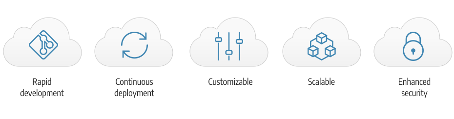

# クラウドインフラストラクチャ上のコマース

Adobe Commerce on cloud infrastructure は、 **セルフサービス** の構築、デプロイ、管理に関するアプローチ [!DNL Commerce] クラウドネイティブ環境のアプリケーション。 Adobe Commerce on cloud infrastructure には、オンプレミスのAdobe CommerceおよびMagento Open Sourceプラットフォームとは別の機能が追加されています。

- PHP、MySQL(MariaDB)、Redis を含む、事前にプロビジョニングされたインフラストラクチャ [!DNL RabbitMQ]、およびサポートされる検索エンジンテクノロジー。
- Platform as a Service(PaaS) 環境でコードの変更をプッシュするたびに、迅速な開発と継続的なデプロイを効率的に行うための、自動ビルドとデプロイを備えた Git ベースのワークフロー。
- 高度にカスタマイズ可能な環境設定ファイルと CLI（コマンドラインインターフェイス）により、ツールの管理と導入が可能になります。
- Amazon Web Services(AWS) は、オンラインでの販売および小売業のための、拡張性と安全性に優れた環境を提供するホスティングを提供します。

次を表示： [技術スタック](architecture/tech-stack.md) の特定の機能とサポート対象製品について詳しくは、 [コマース用クラウドアーキテクチャ](architecture/cloud-architecture.md).

## Adobe Commerceドキュメント

Commerce on cloud infrastructure ガイドは、Adobe Commerceアプリケーションに関する十分な知識と理解を持っていることを前提としています。 以下を参照してください。 [!DNL Commerce] 以下の開発者ガイドとユーザーガイド：

- [Adobe Commerce開発者向けドキュメント](https://developer.adobe.com/commerce/docs/) (Adobe Developerサイト ) — 高度な機能を開発、カスタマイズ、統合、拡張、使用します。

- [Adobe Commerce Documentation](https://experienceleague.adobe.com/docs/commerce.html) (ADOBE EXPERIENCE LEAGUE): [!DNL Commerce] プロジェクト
