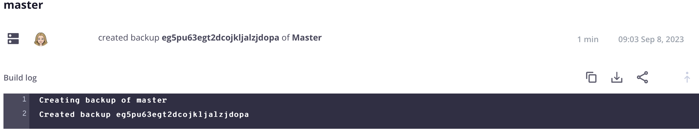

# アクティビティストリーム

各環境のメインビューには、 **Activity** git ログに類似した履歴イベントのリスト。 アクティビティ リストは、アクティブな環境の最近のイベントのストリームです。 アクティビティタイプと、アクティビティストリームに表示されるアイコンのリストを以下に示します。

{width="500" align="center"}

## ログを表示

アクティビティリストで、アクティビティのステータスアイコンをクリックしてログを表示します。 または、 {width="32"} （_詳細_）メニューを使用して、アクティビティを管理するためのその他のオプションにアクセスします。 次に、バックアップを作成する短いログを示します。 次のことができます [Cloud CLI の使用](#activity-stream-with-cloud-cli) をクリックして同じログを表示します。



## アクティビティの管理

一部のアクティビティは _実行中_ または _保留中_ ステータス。 実行中のデプロイメントのキャンセルなど、実行中のアクティビティに対してアクションを実行できます。 次のタブは、アクティビティをキャンセルする 2 つの方法を示しています。 [!DNL Cloud Console] または Cloud CLI です。

>[!BEGINTABS]

>[!TAB コンソール]

**でのアクティビティをキャンセルするには[!DNL Cloud Console]**:

実行中のアクティビティを操作するには、 {width="32"} （_詳細_） メニューとアクションの選択（など） `Cancel` または `View log`. この例では、 **キャンセル** 実行中のアクティビティを停止するオプション。

すべてのアクティビティにキャンセルオプションがあるわけではありません。 例えば、アプリケーションのデプロイメントをキャンセルするオプションは、 _ビルド_ フェーズ。 アプリケーションがに移動した後 _deploy_ フェーズでは、アクティビティをキャンセルできなくなりました。 参照： [デプロイメントプロセス](../deploy/process.md) 様々なフェーズについて。

{width="450" align="center"}

ターミナルでデプロイメントアクティビティを実行している場合、をキャンセルします。 [!DNL Cloud Console] その結果、ターミナルでキャンセルが行われます。

{width="300"}

>[!TAB CLI]

**Cloud CLI でアクティビティをキャンセルするには**:

1. 実行中のアクティビティを特定し、アクティビティ ID を選択します。

   ```bash
   magento-cloud activity:list --state=in_progress
   ```

1. アクティビティ ID を使用してアクティビティをキャンセルします。

   ```bash
   magento-cloud activity:cancel wvl5wm7s5vkhy
   ```

>[!ENDTABS]

## フィルターアクティビティストリーム

アクティビティリストのフィルタリング機能は、バックアップや結合イベントなど、特定の項目を検索する場合に役立ちます。

**でアクティビティリストをフィルタリングするには[!DNL Cloud Console]**:

1. 環境とアクティビティを選択します。 **[!UICONTROL All]** 完全なイベント履歴を含めるには、「」を表示します。

1. クリック {width="32"} を選択し、 **[!UICONTROL Filter by]** オプション：

   

1. アクティビティを選択 **[!UICONTROL Recent]** リストを表示してリセットします。

## Cloud CLI でストリームを表示

この `magento-cloud` CLI は、 [!DNL Cloud Console]. この `activity` コマンドは以下を実行できます。

- `list` 環境のアクティビティストリーム
- `get` 特定のアクティビティに関する詳細
- を表示 `log` 特定のアクティビティ
- `cancel` アクティビティ

**Cloud CLI でアクティビティストリームを表示するには**:

1. 現在の環境のアクティビティを一覧表示します。

   ```bash
   magento-cloud activity:list
   ```

1. 各アクティビティには一意の ID があります。 以前のリストから ID を選択し、そのアクティビティの詳細を表示します。

   ```bash
   magento-cloud activity:get wvl5wm7s5vkhy
   ```

1. そのアクティビティの完全なログを表示します。

   ```bash
   magento-cloud activity:log wvl5wm7s5vkhy
   ```

   応答の例：

   ```bash
   Activity ID: wvl5wm7s5vkhy
   Type: environment.backup
   Description: User created a backup of Master
   Created: 2023-09-08T14:03:33+00:00
   State: complete
   Log:
   Creating backup of master
   Created backup eg5pu63egt2dcojkljalzjdopa
   ```
