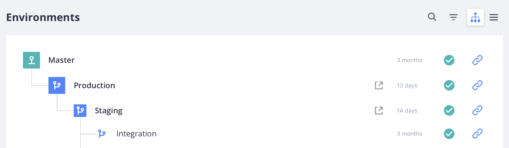

# クラウドインフラストラクチャプロジェクト

クラウドインフラストラクチャー上のAdobe Commerce プロジェクトには、Git ブランチ内のすべてのコード、関連付けられた環境およびデプロイ対象のスクリプトが含まれます [!DNL Commerce] アプリケーション。 環境には、をサポートするサービスが含まれています [!DNL Commerce] アプリケーション （データベース、web サーバー、キャッシュサーバーを含む）。

Adobeはを提供します [!DNL Cloud Console] を使用すると、プロジェクトのあらゆる側面を完全に管理できる開発者ツールを利用できます。 アカウント所有者は、すべての環境に対してフルアクセス権を持ちます。

## [!DNL Cloud Console]

この [!DNL Cloud Console] は、Commerce コードをユーザーにわかりやすい形式で作成、管理およびデプロイするためのインタラクティブなメソッドを提供します。 [にログインします [!DNL Cloud Console]](https://console.adobecommerce.com) をクリックしてプロジェクトリストを表示します。 管理者として、または特定の環境タイプについてアクセスする権限を持っているプロジェクトのみを表示できます。 Adobeソリューションパートナーの場合、サポートしているクライアントに対して複数のプロジェクトが表示される場合があります。

>[!TIP]
>
>プロジェクトが表示されない場合は、に連絡する必要があります [アカウント所有者またはプロジェクト管理者](../project/user-access.md) プロジェクトに関連付けられ、アクセスをリクエストします。 初めてのユーザーについては、を参照してください。 [オンボーディングトピック](../../get-started/onboarding.md#cloud-console) が含まれる _基本を学ぶ_ ガイド。

この _すべてのプロジェクト_ 「表示」には、アクセス権を持つすべてのプロジェクトが一覧表示されます。 次のいずれかをクリックできます。 **[!UICONTROL Show filters]** さらに、タイプ、地域またはプランでプロジェクトリストをフィルタリングできます。


### プロジェクトの概要

からプロジェクトを選択 _すべてのプロジェクト_ リスト プロジェクトの概要が開きます。 プロジェクトの概要には常に、環境セレクターと設定ボタンを含むプロジェクトのナビゲーションバーが表示されます。


環境が選択されていない限り、プロジェクトの概要のプレビューエリアにプロジェクトの詳細の概要が表示されます。

- プロジェクト名
- 地域、プロジェクト ID
- 計画、割り当てられたストレージ、環境、ユーザー
- ストアフロント URL **[!UICONTROL Set a custom domain]** ボタン

また、メインプロジェクトの概要でも同様です。

- 環境ビュー：のリストまたはツリー表示 {width="32"} (active) and {width="32"} （非アクティブな）環境。
- [アクティビティストリーム](activity-stream.md) プロジェクトの実行中、保留中、最近のアクティビティを表示します。
<!-- - Apps & Services—Shows a topology of service containers -->

の場合 **スターター** プロジェクトには、から始まるブランチの階層があります。 `master` （実稼動）。 作成したブランチはすべて、から子として表示されます `master` 分岐。 Adobeでは、以下を作成することをお勧めします `staging` ブランチを作成してから、 `integration` 開発用ブランチ。 参照： [スターターアーキテクチャ](../architecture/starter-architecture.md).

の場合 **プロ**&#x200B;から始まるブランチの階層があります。 `production` 対象： `staging` 対象： `integration`. この {width="32"} アイコンは、ブランチが専用の環境にデプロイされることを示します。 作成したブランチはすべて、の子として表示されます `integration` 分岐。 参照： [Pro アーキテクチャ](../architecture/pro-architecture.md).



### 環境の概要

プロジェクトナビゲーションバーから環境を選択すると、概要とナビゲーションバーが変更され、選択した環境にフォーカスされます。 ナビゲーションバーには、分岐コントロール（分岐、結合、同期）と設定ボタンが含まれています。


環境の概要では、環境の詳細の概要がプレビュー領域に表示されます。

- 環境名、タイプ
- 地域、プロジェクト ID
- 最後のアクティビティの日時（バックアップを含む）
- HTTP アクセスおよび検索エンジンのステータス
- 環境に割り当てられているマシン名
- 環境ステータス（アクティブまたは非アクティブ）
- ストアフロント URL **[!UICONTROL Set a custom domain]** ボタン

また、メイン環境の概要でも以下を行います。

- [アクティビティストリーム](activity-stream.md) メイン環境の概要を作成し、選択した環境の実行中、保留中、最近のアクティビティを表示します。
<!-- - Services tab shows and Apps & Services menu, including overview and configuration tabs for each service. -->
- [「バックアップ」タブ](../storage/snapshots.md#create-a-manual-backup) 保存されているバックアップのリスト、バックアップ操作の履歴、[ バックアップ ] ボタンが表示されます。

### ストアフロントにアクセス

アクティブな環境にはそれぞれストアフロントがあります。 上部ナビゲーションから環境を選択し、環境の概要の URL をクリックします。 また、 **[!UICONTROL URLs]** アクティビティ リストの右上にあるリスト。

Web アクセス URL には、以下が含まれる場合があります。

```terminal
https://<branch>-<unique-ID>-<project-ID>.<region>.magentosite.cloud/
```

- **ユニーク ID** = 7 個のランダムな英数字
- **プロジェクト ID** = 13 文字のプロジェクト ID
- **地域** = AWSまたは Azure の地域名。を参照してください。 [地域の IP アドレス](regional-ip-addresses.md)

実稼動環境とステージング環境には、次のリンクを使用してアクセスできる 3 つのノードが含まれています。

- ロードバランサー URL:

   - `http[s]://<your-domain>.c.<project-ID>.ent.magento.cloud`
   - `http[s]://<your-staging-domain>.c.<project-ID>.ent.magento.cloud`

- 3 台の冗長サーバのいずれかに直接アクセス：

   - `http[s]://<your-domain>.{1|2|3}.<project-ID>.ent.magento.cloud`
   - `http[s]://<your-staging-domain>.{1|2|3}.<project-ID>.ent.magento.cloud`

  実稼働用 URL は、コンテンツ配信ネットワーク（CDN）で使用されます。

## 設定

を開きます _設定_ をクリックしたパネル {width="36"} （設定）アイコンをプロジェクトのナビゲーションの右側に表示します。

### プロジェクト設定

**[!UICONTROL Project Settings]** プロジェクトレベルのコントロールのメニューを拡張して、ユーザーや変数などを管理します。

| オプション | 説明 |
|--------------|-------------------------------------------------------------------------------------------------------------------------------|
| 一般 | バックアップまたはメンテナンスのスケジュールで使用するタイムゾーンを管理します。 |
| アクセス | 管理 [ユーザーアクセス](user-access.md) をプロジェクトおよび環境タイプに対して実行します。 |
| 証明書 | プロジェクトに関連付けられている SSL 証明書のリストを表示します。 |
| キーのデプロイ | 公開鍵を追加し、プロジェクトコードリポジトリに表示します。 |
| ドメイン | ドメイン名をプロジェクトに追加します。 参照： [ドメインの管理](../cdn/fastly-custom-cache-configuration.md#manage-domains). |
| 統合 | 追加と管理 [統合](../integrations/overview.md)（医療通知および Webhook など）。 |
| 変数 | 追加 [プロジェクトレベルの変数](../environment/variable-levels.md) すべての環境のビルド時および実行時に使用できます。 |

{style="table-layout:auto"}

### 環境設定

クリック **[!UICONTROL Environments]** さらに、サイト設定や環境変数などを管理するコントロールのリストから特定の環境を選択します。

| オプション | 説明 |
| --------- | -------------------------------------------------------------------------------------------------------------------------------- |
| 一般 | 表示名、環境タイプ、親環境を設定します。<br>様々な環境設定を切り替えます。 |
|           | **送信メールを有効にする**：送信 [送信メール](outgoing-emails.md) SMTP プロトコルを使用して環境から。 |
|           | **検索エンジンに表示しない**：サイトからの検索エンジンインデクサーおよびクローラーをブロックします。 |
|           | **HTTP アクセス制御**：のセキュリティ設定を有効にします。 [!DNL Cloud Console] ログインと IP アドレスのアクセス制御を使用する。 |
|           | ステータス : `active` または `inactive`. ほとんどの作業は、アクティブな環境で行われています。 環境は、非アクティブ化または削除できます。 |
| 変数 | 表示、作成、管理 [環境レベル変数](../environment/variable-levels.md) は実行時に使用できます。 |
| ドメイン | のリストを表示 [設定済みのルート](../routes/routes-yaml.md). |

{style="table-layout:auto"}

>[!WARNING]
>
>**DO NOT** pro ステージング環境と実稼動環境をセキュリティで保護するには、HTTP アクセス制御方法を使用します。 これにより、Fastly のキャッシュが中断されます。 代わりに、を使用します [ブロック](../cdn/fastly-vcl-blocking.md) Adobe Commerce用 Fastly CDN で使用できる機能。

## Fastly とNew Relicの資格情報

プロジェクトに次が含まれる [Fastly](../cdn/fastly.md) および [New Relic](../monitor/new-relic-service.md). プロジェクトの詳細には、プロジェクトプランの情報と、これらの統合に必要な重要なライセンスとトークンが表示されます。 資格情報とサービスに最初にアクセスできるのはライセンス所有者のみです。 必要に応じて、これらの資格情報を技術リソースおよび開発者リソースに提供します。

- [Fastly](https://www.fastly.com/) は、クラウドインフラストラクチャプロジェクト上のAdobe Commerceにコンテンツ配信（CDN）、画像の最適化、セキュリティサービス（DDoS および WAF）を提供します。 参照： [Fastly 資格情報の取得](../cdn/fastly-configuration.md#get-fastly-credentials).

- [New Relic](../monitor/new-relic-service.md) ステージング環境と実稼動環境のアプリケーション指標とパフォーマンス情報を提供します。

の使用 [クラウド CLI](../dev-tools/cloud-cli-overview.md) 統合トークンや ID などを確認するには：

```bash
magento-cloud subscription:info services
```
