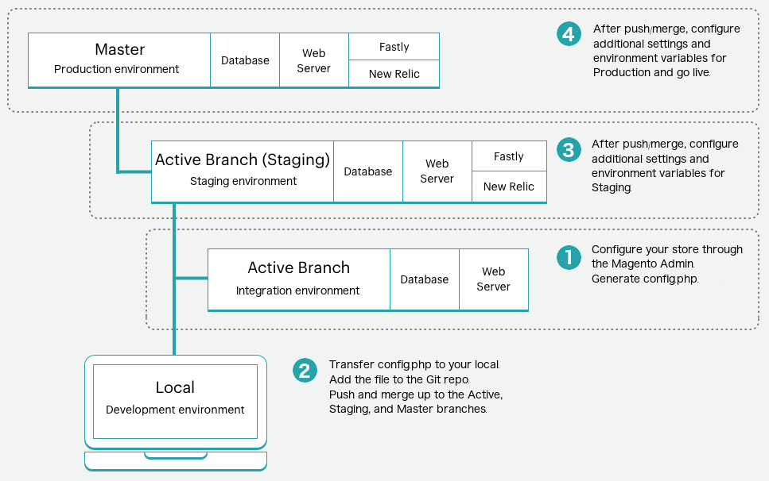

# ストアの設定管理

ストアのデフォルトの設定は、に保存されています。 `config.xml` （該当するモジュールの場合）。 Commerce Admin または CLI で設定を変更した場合 `bin/magento config:set` コマンドを実行すると、変更がコアデータベース（特に `core_config_data` テーブル。 これらの設定は、に保存されたデフォルトの設定を上書きします `config.xml` ファイル。

設定を保存します。これは、管理の設定を参照します **ストア** > **設定** > **設定** セクションのは、設定のタイプに基づいてデプロイメント設定ファイルに格納されます。

- `app/etc/config.php` – ストア、web サイト、モジュールまたは拡張機能の設定、静的ファイル最適化、静的コンテンツのデプロイメントに関連するシステム値。 を参照してください。 [config.php リファレンス](https://experienceleague.adobe.com/docs/commerce-operations/configuration-guide/files/config-reference-configphp.html) が含まれる _設定ガイド_.
- `app/etc/env.php`- システム固有のオーバーライドと重要な設定の値 _ではない_ ソースコントロールに保存される。 を参照してください。 [env.php リファレンス](https://experienceleague.adobe.com/docs/commerce-operations/configuration-guide/files/config-reference-envphp.html) が含まれる _設定ガイド_.

>[!NOTE]
>
>クラウドインフラストラクチャー上のAdobe Commerceでは、実稼働モードとメンテナンスモードのみをサポートしているので、 **詳細** > **開発者** 管理者で「」セクションにアクセスできません。 以下が必要です [環境管理者権限](../project/user-access.md) 構成管理タスクを完了します。 次を使用して、追加設定を指定できます [環境変数](../environment/configure-env-yaml.md).

構成管理では、パイプラインデプロイメントを使用して、ダウンタイムを最小限に抑えながら、環境全体で一貫性のあるストア設定をデプロイする方法を提供します。 クラウドインフラストラクチャプロジェクト上のAdobe Commerceには、で設計された、ビルドサーバー、ビルドおよびデプロイスクリプト、デプロイメント環境が含まれます [パイプラインデプロイメント戦略](https://experienceleague.adobe.com/docs/commerce-operations/configuration-guide/deployment/technical-details.html) 覚えておいて。

## 構成オーバーライド スキーム

すべてのシステム設定は、次のオーバーライドスキームに従ってビルドおよびデプロイフェーズで設定されます。

1. 環境変数が存在する場合、カスタム設定を使用し、デフォルト設定を無視します。
1. 環境変数が存在しない場合は、 `MAGENTO_CLOUD_RELATIONSHIPS` 内の名前と値のペア [`.magento.app.yaml` ファイル](../application/configure-app-yaml.md). デフォルトの設定を無視します。
1. 環境変数が存在しない場合、および `MAGENTO_CLOUD_RELATIONSHIPS` に名前と値のペアが含まれていない場合は、カスタマイズした設定をすべて削除し、デフォルト設定の値を使用します。

要約すると、環境変数は他のすべての値を上書きします。

>[!TIP]
>
>参照： [設定管理](https://experienceleague.adobe.com/docs/commerce-operations/configuration-guide/deployment/technical-details.html) が含まれる _設定ガイド_ パイプラインデプロイメントのオーバーライドスキームについて詳しくは、こちらを参照してください。

同じ設定が複数の場所で設定されている場合、アプリケーションは次の設定階層に基づいて、環境に適用する値を決定します。

| 優先度 | 設定<br>メソッド | 説明 |
| -------- | ------------------------ | ----------- |
| 1 | [!DNL Cloud Console]<br>環境変数 | から追加された値 _変数_ の「環境設定」タブ [!DNL Cloud Console]. ここで、機密性の高い設定や環境固有の設定の値を指定します。 ここで指定した設定は、管理者から編集できません。 参照： [環境設定変数](../project/overview.md#configure-environment). |
| 2 | `.magento.app.yaml` | に追加された値 `variables` の節 `.magento.app.yaml` ファイル。 ここで値を指定し、すべての環境で一貫した設定を行います。 **で機密値を指定しないでください `.magento.app.yaml` ファイル。** 参照： [アプリケーション設定](../application/configure-app-yaml.md). |
| 3 | `app/etc/env.php` | ここに格納された、環境固有の設定値は、 `app:config:dump` コマンド。 環境変数または CLI を使用して、システム固有の機密性の高い値を設定します。 参照： [機密データ](#sensitive-data). この `env.php` ファイルは **ではない** ソースコントロールに含まれます。 |
| 4 | `app/etc/config.php` | ここに格納された値は、 `app:config:dump` コマンド。 共有設定値はに追加されます。 `config.php`. 管理者から、または CLI を使用して共有構成を設定します。 この `config.php` ファイルはソース管理に含まれます。 |
| 5 | データベース | ここに格納された値は、管理者の設定によって追加されます。 上記の方法のいずれかを使用して設定された設定は、ロック（グレー表示）され、管理者から編集できません。 |
| 6 | `config.xml` | 多くの設定では、にデフォルト値が設定されています。 `config.xml` モジュールのファイル。 上記のいずれかの方法で設定された値がAdobe Commerceで見つからない場合、設定されていれば、デフォルト値にフォールバックします。 |

{style="table-layout:auto"}

## 設定ダンプ

次を使用できます `ece-tools` を生成するためのコマンド `config.php` 現在のすべてのストア設定を含むファイル：

```bash
./vendor/bin/ece-tools config:dump
```

データがに「ダンプ」されます。 `app/etc/config.php` ファイルが _locked_&#x200B;つまり、Commerce管理者の対応するフィールドはになります **読み取り専用**. この `config.php` ファイルには、設定した設定のみが含まれます。 デフォルト値はロックされません。 また、更新した値のみをロックすると、特に Fastly の場合、読み取り専用設定が原因で、ステージング環境と実稼動環境で使用されるすべての拡張機能が破損しなくなります。

>[!WARNING]
>
>この `ece-tools config:dump` コマンドが、B2B などのモジュールの詳細設定を取得しない。 包括的な設定ダンプが必要な場合は、 `app:config:dump` コマンド。ただし、このコマンドは、設定値を読み取り専用状態でロックします。

### 機密データ

に書き出す機密設定 `app/etc/env.php` を使用する場合、ファイルは `bin/magento app:config:dump` コマンド。 機密性の高い値は、CLI コマンドを使用して設定できます。 `bin/magento config:sensitive:set`. 参照：  [機密性の高い環境固有の設定](https://developer.adobe.com/commerce/php/development/configuration/sensitive-environment-settings/) が含まれる _Commerce PHP Extensions_ 構成設定を機密またはシステム固有のものとして指定する方法について説明します。

のリストを参照 [機密またはシステム固有の設定](https://experienceleague.adobe.com/docs/commerce-operations/configuration-guide/paths/config-reference-sens.html) が含まれる _設定ガイド_.

### SCD パフォーマンス

ストアのサイズによっては、デプロイする静的コンテンツファイルが多数ある場合があります。 通常、静的コンテンツのデプロイは、アプリケーションがメンテナンスモードのデプロイ段階でおこなわれます。 最も最適な設定は、ビルドフェーズで静的コンテンツを生成することです。 参照： [デプロイ方法の選択](../deploy/static-content.md).

設定のダンプ後に設定管理を有効にした場合は、SCD_*変数をデプロイステージからビルドステージに移動し、ビルドフェーズ中に静的コンテンツの生成を適切に有効にする必要があります。 参照： [環境変数](../environment/configure-env-yaml.md#environment-variables).

**構成管理前**:

```yaml
  deploy:
    CRON_CONSUMERS_RUNNER:
      cron_run: true
      consumers: []
    SCD_STRATEGY: compact
    SCD_MATRIX:
      ...
    REDIS_USE_SLAVE_CONNECTION: 1
```

**構成管理を有効にした後**:

SCD_*変数をビルドステージに移動します。

```yaml
  deploy:
    CRON_CONSUMERS_RUNNER:
      cron_run: true
      consumers: []
    REDIS_USE_SLAVE_CONNECTION: 1
  build:
    SCD_STRATEGY: compact
    SCD_MATRIX:
      ...
```

>[!NOTE]
>
>静的ファイルをデプロイする前に、ビルドフェーズとデプロイフェーズで、GZIP を使用して静的コンテンツを圧縮します。 静的ファイルを圧縮すると、サーバーの負荷が軽減され、サイトのパフォーマンスが向上します。 参照： [ビルドオプション](../environment/variables-build.md) で、ファイル圧縮のカスタマイズまたは無効化について説明します。

## 設定を管理する手順

以下に、このプロセスの概要を示します。



**ストアを設定し、設定ファイルを生成するには**:

1. いずれかの環境で、管理者のストアのすべての設定を完了します。

   - スターター：アクティブな開発ブランチ
   - Pro：統合環境のアクティブなブランチ

   この環境からステージング環境および実稼動環境にデータベースをダンプする予定がない限り、これらの設定には実際の製品は含まれません。 通常、開発データベースには、完全なストアデータは含まれていません。

1. ローカルワークステーションで、をプロジェクトディレクトリに変更します。

1. リモート・データベースのローカル・ダンプを作成します。

   ```bash
   magento-cloud db:dump
   ```

1. コードの変更を追加、コミット、プッシュして、リモート環境を更新します。

   ```bash
   git add app/etc/config.php
   ```

   ```bash
   git commit -m "Add system-specific configuration"
   ```

   ```bash
   git push origin <branch-name>
   ```

デプロイメントが完了したら、更新された環境の管理者にログインして、設定を確認します。 必要に応じて、追加の設定をステージング環境と実稼動環境に引き続き結合します。

### 設定を更新

管理者を通じて環境を変更し、コマンドを再度実行すると、新しい設定がのコードに追加されます。 `config.php` ファイル。

>[!WARNING]
>
>を手動で編集する場合 `config.php` ステージング環境と実稼動環境では、ファイルは次のようになります **ではない** 推奨。 ファイルは、すべての環境ですべての設定の一貫性を維持するのに役立ちます。 決して削除しない `config.php` ファイルを再構築するためのものです。 ファイルを削除すると、ビルドプロセスおよびデプロイプロセスに必要な特定の設定を削除できます。

### 設定ファイルの復元

オリジナルのコピー `app/etc/env.php` および `app/etc/config.php` ファイルはデプロイメントプロセス中に作成され、同じフォルダーに保存されます。 以下に、BAK （バックアップファイル）と PHP （元のファイル）を同じ形式で示します `app/etc` フォルダー：

```terminal
...
config.php.bak
di.xml
env.php.bak
vendor_path.php
config.php
db_schema.xml
env.php
...
```

以前の設定では、 `app/etc/config.local.php` ファイル。 参照： [古い設定を移行](#migrate-older-configurations).

**設定ファイルを復元するには**:

1. ローカルワークステーションで、SSH を使用してリモートプロジェクトおよび環境にログインします。

   ```bash
   magento-cloud ssh
   ```

1. バックアップファイルの場所と可用性を確認します。

   ```bash
   ./vendor/bin/ece-tools backup:list
   ```

   応答の例：

   ```terminal
   The list of backup files:
   app/etc/env.php
   app/etc/config.php
   ```

1. バックアップファイルを復元します。

   ```bash
   ./vendor/bin/ece-tools backup:restore
   ```

### 古い設定を移行

Cloud infrastructure 2.2 以降でAdobe Commerceにアップグレードする場合は、から設定を移行してください。 `config.local.php` 新しいにファイル `config.php` ファイル。 管理者の設定がファイルの内容と一致する場合は、の手順に従って生成し追加します。 `config.php` ファイル。

異なる場合は、のコンテンツを追加できます `config.local.php` 新しいにファイル `config.php` ファイル：

1. 指示に従って、を生成します `config.php` ファイル。

1. を開きます `config.php` ファイルを作成して、最後の行を削除します。

1. を開きます `config.local.php` ファイルを作成して、コンテンツをコピーします。

1. 内容をに貼り付けます。 `config.php` ファイルを作成して保存し、Git への追加を完了します。

1. 環境全体にデプロイします。

この移行は 1 回だけ完了します。 移行後、を使用します `config.php` ファイル。

### ロケールを変更

複雑な設定の読み込みと書き出しのプロセスに従わずに、ストアロケールを変更できます。 _もし_ 次を持っています： [SCD_ON_DEMAND](../environment/variables-global.md#scd_on_demand) 有効。 管理者を使用してロケールを更新できます。

を有効にすることで、別のロケールをステージング環境または実稼動環境に追加できます `SCD_ON_DEMAND` 統合ブランチで、更新後のを生成します `config.php` 新しいロケール情報を含んだファイルを作成し、設定ファイルをターゲット環境にコピーします。

>[!WARNING]
>
>このプロセス **上書き** ストアの設定。環境に同じストアが含まれている場合のみ、次の操作を行います。

1. 統合環境で、を有効にします `SCD_ON_DEMAND` を使用した変数 [`.magento.env.yaml` ファイル](../environment/configure-env-yaml.md).

1. 管理者を使用して、必要なロケールを追加します。

1. SSH を使用してリモート環境にログインし、 `/app/etc/config.php` すべてのロケールを含むファイル。

   ```bash
   ssh <SSH-URL> "./vendor/bin/ece-tools config:dump"
   ```

1. 新しい設定ファイルをリモート統合環境からローカル環境ディレクトリにコピーします。

   ```bash
   rsync <SSH-URL>:app/etc/config.php ./app/etc/config.php
   ```

1. コードの変更を追加、コミット、プッシュして、リモート環境を更新します。
